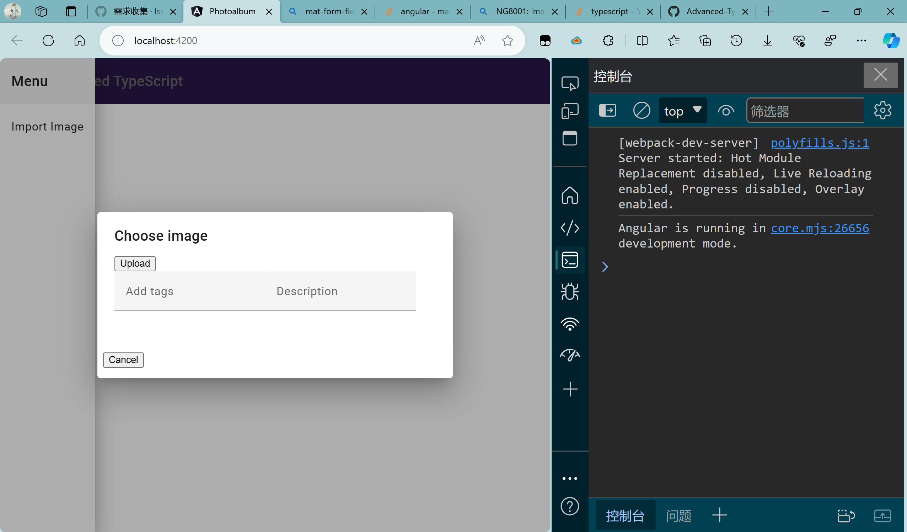

# Photoalbum

This project was generated with [Angular CLI](https://github.com/angular/angular-cli) version 16.2.8.

## Development server

Run `ng serve` for a dev server. Navigate to `http://localhost:4200/`. The application will automatically reload if you change any of the source files.

## Code scaffolding

Run `ng generate component component-name` to generate a new component. You can also use `ng generate directive|pipe|service|class|guard|interface|enum|module`.

## Build

Run `ng build` to build the project. The build artifacts will be stored in the `dist/` directory.

## Running unit tests

Run `ng test` to execute the unit tests via [Karma](https://karma-runner.github.io).

## Running end-to-end tests

Run `ng e2e` to execute the end-to-end tests via a platform of your choice. To use this command, you need to first add a package that implements end-to-end testing capabilities.

## Further help

To get more help on the Angular CLI use `ng help` or go check out the [Angular CLI Overview and Command Reference](https://angular.io/cli) page.


# 创建应用程序
`npm install -g @angular/cli`
创建本项目
`ng new photoalbum --style scss --prefix pa`
接受默认的安装配置，一路回车
> SCSS为使用样式混入等提供了丰富的语法
启动Angular服务器，监视文件是否发生变化
`ng serve --open`
端口4200，显示默认Angular示例页面

# 安装Angular Material
```bash
ng add @angular/material @angular/cdk @angular/animation @angular/flex-layout
```

# 创建FileUpload组件
`ng generate component components/fileupload`
创建了四个文件 *.html, *.scss, *.spec.ts, *.ts
创建服务，服务就是一个类，它使用@Injectable装饰器
我们将创建一个服务，使其读入一个使用文件选择器选择的文件，
从而能够在图片上传对话框和主屏幕上显示该文件，或者将其传输并保存到数据库。
`ng generate service Services/FilePreviewService`

# 存档点1


# 引入对Express的支持
Express是一个中间件框架

# 跨域请求共享
Cross Origin Request Sharing
启用CORS时，让已知的外部位置能够访问我们网站上的受限操作。
站点不同，需要启用CORS来允许提交请求。
否则从Angular发出请求给Express，并不会返回任何东西。
首先，在Express项目中添加cors中间件。
`npm install cors @types/cors --save`
添加CORS支持

# 把请求 路由到 合适的请求处理程序
## 提供路由支持
